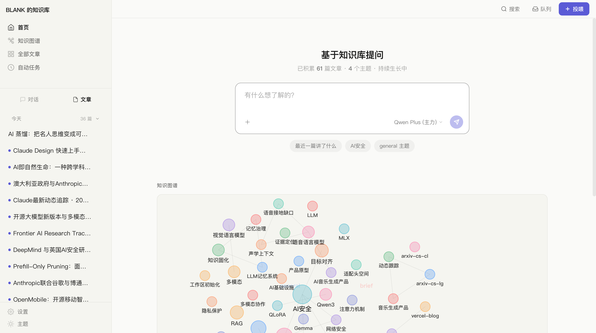
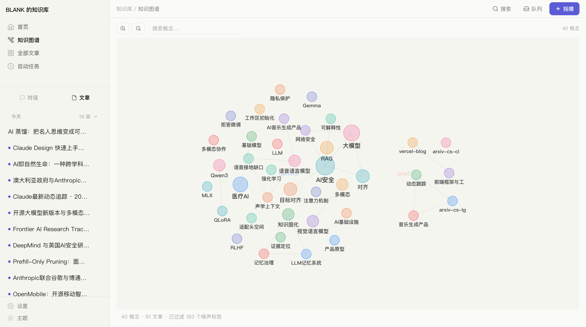
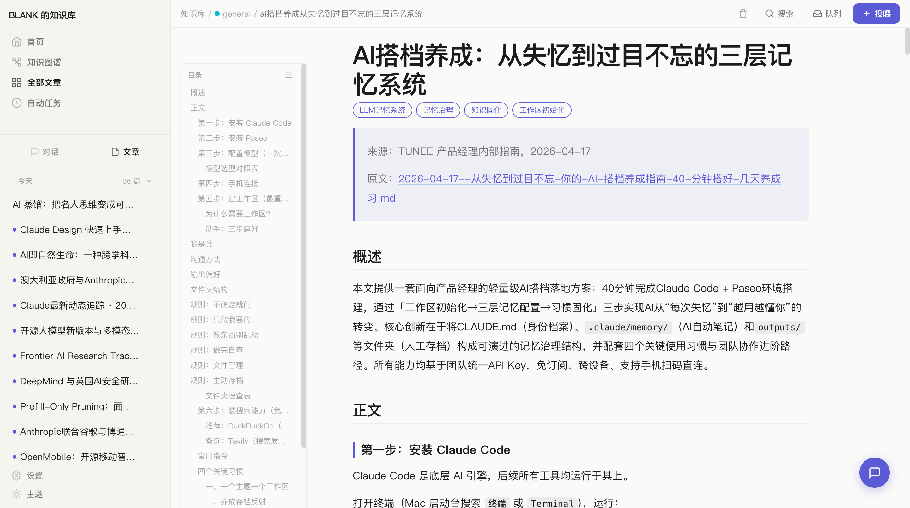
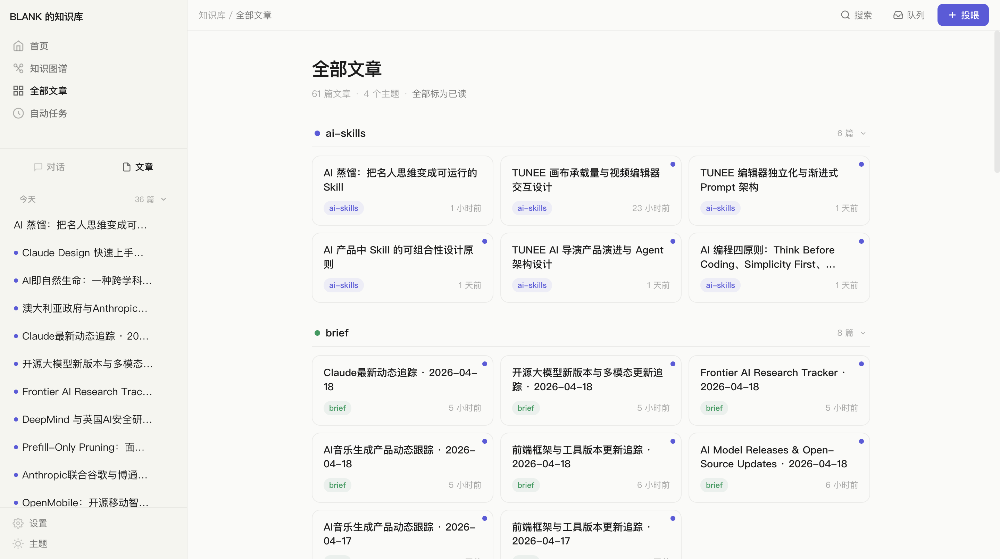
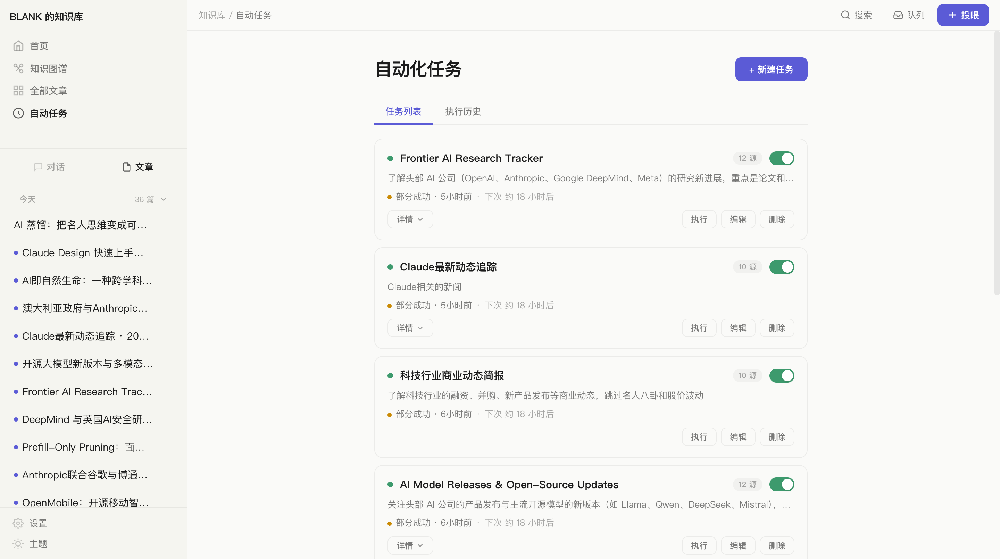
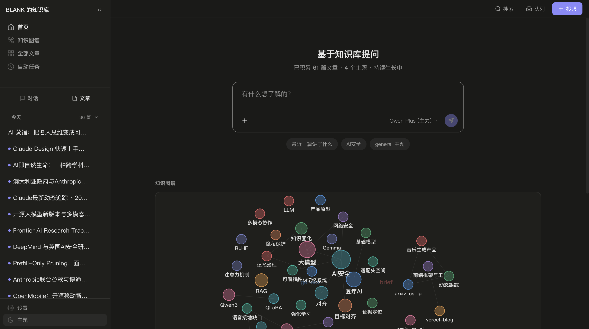

# Pith

Drop a URL, a PDF, a screenshot, or just paste text -- AI reads it, structures it, and files it into your personal knowledge base. Next time you need it, search or just ask in natural language.

Set up RSS feeds and web sources, AI monitors them daily, filters what matters to you, and writes the articles. Your knowledge base grows while you sleep.

Built in a few hours of pure vibe coding with [Claude Code](https://claude.ai/code). Zero framework, zero build step, zero database -- just Node.js and vanilla JS. UI in Chinese, English, Japanese, Korean. Inspired by [Andrej Karpathy](https://x.com/karpathy)'s idea: let LLMs maintain a wiki that compounds over time.

**[中文](docs/README.zh.md) | [日本語](docs/README.ja.md) | [한국어](docs/README.ko.md) | [Espanol](docs/README.es.md) | [Portugues](docs/README.pt.md) | [Deutsch](docs/README.de.md)**

## Screenshots

| Dashboard | Knowledge Graph |
|:-:|:-:|
|  |  |

| Article Reading | Browse Articles |
|:-:|:-:|
|  |  |

| Automated Tasks | Dark Mode |
|:-:|:-:|
|  |  |

## Download

**[macOS (Apple Silicon) DMG](https://github.com/gongty/pith/releases/latest)**

Unsigned build -- first launch: right-click > Open, or run `xattr -cr /Applications/Pith.app`.

## What problems does it solve?

**Information is scattered, read and forgotten.** Notes in one app, bookmarks in another, PDFs on your desktop. Pith turns all of them into searchable, interconnected articles -- automatically.

**You want to ask questions based on your own knowledge, not generic AI.** The built-in chat uses RAG (retrieval-augmented generation) to answer from your wiki. Every answer is grounded in articles you've accumulated.

**You want AI to monitor topics you care about, daily.** Set up automated tasks with RSS feeds, web pages, and APIs as sources. AI fetches, filters, and compiles new articles on a schedule -- your personal research assistant.

## Features

- **Ingest anything** -- Paste text, drop files (PDF, images, audio, video, ZIP), or enter URLs. AI compiles them into structured articles with tags, summaries, and cross-references.
- **Chat with your knowledge** -- RAG-powered Q&A that retrieves context from your wiki. Hybrid search: BM25 keywords + vector embeddings (RRF fusion).
- **Knowledge graph** -- Force-directed visualization of concepts and articles. See how your knowledge connects.
- **Article Q&A** -- Floating panel on each article for in-context questions. Per-article conversation sessions with streaming responses.
- **Automated tasks** -- AI research assistant that monitors RSS/web/API sources on a schedule. LLM relevance gating, dedup, and daily briefings.
- **Rich editing** -- Notion-style contenteditable editor with floating toolbar, auto-save, tag management, and table of contents.
- **Multi-LLM** -- Bailian (Alibaba), OpenRouter, Anthropic, OpenAI, DeepSeek, or custom providers.
- **Multi-language UI** -- Chinese, English, Japanese, Korean.
- **Dark mode** -- Full dark theme with carefully tuned tokens.
- **Zero framework** -- Vanilla JS frontend, no build step. Edit and refresh.

## Quick Start

```bash
git clone https://github.com/gongty/pith.git
cd pith
npm install
WIKI_API_KEY=your-api-key node server.js
# Open http://localhost:3456
```

Default port: 3456. Configure your LLM provider in Settings after first launch.

## Configuration

### Environment Variables

| Variable | Required | Description |
|----------|----------|-------------|
| `WIKI_API_KEY` | Yes | API key for your LLM provider |
| `WIKI_ADMIN_TOKEN` | Production | Auth token (16+ chars) to protect write endpoints |
| `PORT` | No | Server port (default: 3456) |

### LLM Providers

Configure in Settings after launch:

| Provider | Notes |
|----------|-------|
| Bailian (Alibaba Cloud) | Default. DashScope API |
| OpenRouter | Multi-model aggregator |
| Anthropic | Claude models |
| OpenAI | GPT models |
| DeepSeek | Chinese LLM |
| Custom | Any OpenAI-compatible endpoint |

## Tech Stack

| Layer | Choice | Why |
|-------|--------|-----|
| Backend | Node.js stdlib | Single-file server, zero backend dependencies |
| Frontend | Vanilla JS + ES Modules | No framework, no bundler, no build step |
| Styling | CSS Custom Properties | Design tokens cascade, dark mode built in |
| Storage | File system | Markdown + JSON, no database |
| AI | Multi-provider | Unified `callLLM()` interface |

## Project Structure

```
pith/
├── server.js          # Node.js HTTP server (~6700 lines, API + static files)
├── app/
│   ├── index.html     # HTML shell
│   ├── css/           # Design system ("Warm Ink": indigo accent, warm paper)
│   └── js/            # ES Modules
│       ├── app.js     # Entry point
│       ├── router.js  # Hash-based routing
│       └── pages/     # dashboard, chat, article, graph, browse, autotask
└── data/              # Auto-created, gitignored
    ├── wiki/          # Compiled markdown articles by topic
    ├── raw/           # Immutable source materials
    ├── chats/         # Conversation history (JSON)
    ├── autotasks/     # Task configs, run history, dedup index
    └── vectors/       # Embedding index for semantic search
```

## Contributing

Issues and pull requests are welcome.

## License

MIT
